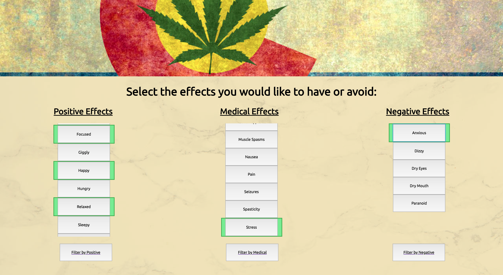

#  First Trip  

## Synopsis

First trip is a tool to help out of state visitors find the correct strain of marijuana that has effects they would like to experience so they can get the most enjoyment out of their first trip.

### Technologies

React - Redux - Router - SASS - Jest

### Tools

[The Strain API](http://strains.evanbusse.com/index.html) -
Firebase - GitHub Projects

***

### **_Examples_** 
**Home Page**

**Search Page**

**Results Page**

---

## Contributors
[Jim Dechant](https://github.com/Ecksi/)
